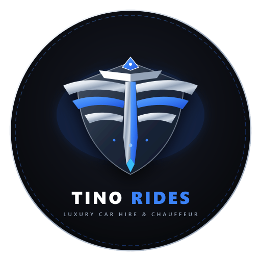

<div align="center">

  

  # TINO RIDES
  ### Premier Luxury Car Rental & VIP Chauffeur Services

  [](https://nextjs.org/)
  [](https://react.dev/)
  [](https://tailwindcss.com/)
  [](https://www.typescriptlang.org/)
  [](LICENSE)

  <p align="center">
    <strong>Experience Nigeria's most distinguished fleet of supercars, executive sedans, and armored SUV convoys.</strong><br />
    Serving Lagos (Victoria Island, Ikoyi, Lekki), Abuja (FCT), Port Harcourt, and nationwide intercity VIP protection details.
  </p>

  <br />

  

</div>

---

## 📋 Table of Contents

- [Overview](#-overview)
- [Key Features](#-key-features)
- [Tech Stack & Architecture](#-tech-stack--architecture)
- [Brand Identity & Logo](#-brand-identity--logo)
- [Open Graph & Social Metadata](#-open-graph--social-metadata)
- [Project Structure](#-project-structure)
- [Getting Started](#-getting-started)
  - [Prerequisites](#prerequisites)
  - [Installation](#installation)
  - [Development Server](#development-server)
  - [Production Build](#production-build)
- [Fleet & Service Categories](#-fleet--service-categories)
- [Asset Generation Script](#-asset-generation-script)
- [Environment Variables](#-environment-variables)
- [Deployment](#-deployment)
- [Contributing & License](#-contributing--license)

---

## 🌟 Overview

**TINO RIDES** is a modern, high-performance web platform built for Nigeria's premier luxury mobility service. Designed to cater to high-net-worth individuals, multinational executives, dignitaries, celebrities, and diaspora visitors, TINO RIDES provides seamless on-demand access to:

1. **Exotic Supercars & Luxury Sedans** (Rolls-Royce Ghost, Bentley Flying Spur, Mercedes-Maybach, Ferrari, Porsche).
2. **Armored & Heavy SUVs** (Toyota Land Cruiser 300 B6 Ballistic, Range Rover Autobiography, Toyota Tundra TRD Pro).
3. **VIP Armed Escort & Tactical Convoys** (Intercity protection routes: Lagos — Abuja, Lagos — Ibadan, Port Harcourt — Owerri).
4. **Dedicated Chauffeur & Airport Tarmac Concierge** (Murtala Muhammed International Airport LOS, Nnamdi Azikiwe International Airport ABV).

---

## ✨ Key Features

- **🏎️ Interactive Live Fleet Showcase**: Multi-angle visual gallery for each vehicle including cockpit, passenger lounge, front profile, and dynamic road views.
- **🛠️ Instant Vehicle Configurator & Booking Modal**:
  - Live exterior color visualizer (Obsidian Black, Arctic White, Emerald Green, Metallic Bronze, Silver Frost).
  - Addon toggles: Certified Professional Chauffeur, Armed Tactical Security Escort, Intercity Fuel Allowance, VIP Airport Meet-and-Greet.
  - Real-time rental duration calculator with transparent pricing in Nigerian Naira (₦).
  - Instant direct reservation form with validation and booking confirmation generator.
- **✨ Luxury Dark-Mode Aesthetic**: Curated obsidian dark palette (`#111215`), electric royal blue accents (`#3b82f6`), brushed platinum chrome facets, and glassmorphism headers.
- **🏷️ Authentic Automotive Brand Marquee**: Smooth infinite-scroll marquee featuring official automotive marque emblems (Rolls-Royce, Bentley, Mercedes-Benz, Audi, BMW, Cadillac, Ferrari, Lamborghini, Lexus, Porsche, Tesla).
- **📱 Responsive Mobile-First Architecture**: Precision-engineered touch targets, fluid mobile navigation drawer, and optimized media for high-DPI displays.
- **⚡ Next.js 16 App Router & Turbopack**: Blazing-fast page loads, static optimization, and optimized font loading with Google's Poppins and Mona Sans.

---

## 🛠️ Tech Stack & Architecture

| Layer | Technology | Description |
| :--- | :--- | :--- |
| **Framework** | [Next.js 16.3.8](https://nextjs.org/) | React Server Components, App Router, Turbopack engine |
| **Library** | [React 19.2.8](https://react.dev/) | Modern concurrent features and hooks |
| **Styling** | [Tailwind CSS v4](https://tailwindcss.com/) | Next-generation utility-first styling with PostCSS integration |
| **Type Safety** | [TypeScript 5](https://www.typescriptlang.org/) | Strict compile-time validation |
| **Image Processing** | [Sharp 0.35.5](https://sharp.pixelplumbing.com/) | High-performance vector rasterization and image compositing |
| **Package Manager**| [pnpm 12.8.1](https://pnpm.io/) | Fast, disk space efficient package manager |

---

## 🎨 Brand Identity & Logo

The brand mark for **TINO RIDES** fuses aerodynamic winged velocity with an architectural **"T"** crest monogram, set against a brushed platinum-chrome and electric sapphire shield:

| Asset | Preview | Purpose | Format |
| :--- | :---: | :--- | :---: |
| **Master Emblem** | `public/logo.png` | 512x512 app badge, favicon & brand mark | PNG / SVG |
| **Horizontal Logo (Dark)** | `public/tino-rides-logo.svg` | Scalable navbar & header logo | SVG / PNG |
| **Horizontal Logo (Light)**| `public/tino-rides-logo-light.svg` | Light-background variant | SVG / PNG |
| **Pure Icon Mark** | `public/tino-rides-icon.svg` | Minimalist standalone icon | SVG |
| **Apple Touch Icon** | `public/apple-touch-icon.png` | 180x180 iOS home screen icon | PNG |
| **PWA Mobile Icon** | `public/logo-192.png` | 192x192 Android / PWA icon | PNG |

---

## 🌐 Open Graph & Social Metadata

TINO RIDES includes complete social graph tags configured in `app/layout.tsx` for optimal link previews on **WhatsApp, X (Twitter), Facebook, LinkedIn, iMessage, and Slack**:

- **Open Graph Image (`/og-image.png`)**: A 1200x630 composited image featuring the luxury black showroom SUV, Rolls-Royce Ghost cutout, glowing brand emblem, and executive service badges.
- **Twitter Card**: `summary_large_image` with targeted title and description.
- **Web App Manifest**: `public/site.webmanifest` with PWA compliance.
- **Robots & Canonical Links**: Comprehensive indexing tags for Googlebot and search engines.

---

## 📁 Project Structure

```text
tino-rides/
├── app/
│   ├── layout.tsx                 # Root layout with Metadata & Open Graph configuration
│   ├── page.tsx                   # Main landing page assembling all sections
│   ├── globals.css                # Global styles & Tailwind CSS v4 directives
│   ├── favicon.ico                # Root favicon
│   ├── icon.png                   # Next.js auto-discovered favicon (512x512)
│   ├── apple-icon.png             # Next.js auto-discovered Apple touch icon (180x180)
│   ├── opengraph-image.png        # Next.js auto-discovered Open Graph banner (1200x630)
│   └── preview-mobile-details/    # Mobile preview sub-route
├── components/
│   ├── Hero.tsx                   # Top floating glass navbar & showroom hero
│   ├── CarCategory.tsx            # Vehicle class tabs (Luxury Sedans, SUVs, Armored)
│   ├── TrendVehicles.tsx          # Featured trending fleet cards with quick modal triggers
│   ├── VehicleDetailsModal.tsx    # Interactive booking modal, color picker & gallery
│   ├── AboutUs.tsx                # Corporate background, values & heritage
│   ├── Features.tsx               # Value propositions (Armored B6, Chauffeur, GPS)
│   ├── PromoBanner.tsx            # Special offer & VIP membership banner
│   ├── BrandMarquee.tsx           # Infinite auto-scrolling brand logo ticker
│   └── Footer.tsx                 # Comprehensive footer with routes, newsletter & logo
├── public/
│   ├── logo.png                   # 512x512 Master Brand Logo
│   ├── tino-rides-emblem.svg      # Standalone vector emblem
│   ├── tino-rides-logo.svg        # Horizontal vector brand logo
│   ├── og-image.png               # 1200x630 Open Graph preview image
│   ├── site.webmanifest           # PWA web application manifest
│   ├── vehicles/                  # Vehicle cutout PNGs and multi-angle interior/exterior photos
│   └── logos/                     # Official car manufacturer badges
├── scripts/
│   └── generate-assets.js         # Automated SVG generation & Sharp rasterization pipeline
├── package.json                   # Project scripts and dependencies
├── tsconfig.json                  # TypeScript compiler settings
└── next.config.ts                 # Next.js configuration
```

---

## 🚀 Getting Started

### Prerequisites

Ensure you have the following installed on your machine:
- **Node.js**: `v20.x` or higher
- **pnpm**: `v10.x` or higher (recommended), or `npm` / `yarn`

### Installation

Clone the repository and install dependencies:

```bash
git clone https://github.com/IsaacWinner18/tino-rides.git
cd tino-rides
pnpm install
```

### Development Server

Start the local development server:

```bash
pnpm dev
```

Open [http://localhost:3000](http://localhost:3000) in your browser to view the application.

### Production Build

Create an optimized production bundle:

```bash
pnpm build
pnpm start
```

---

## 🚗 Fleet & Service Categories

1. **Ultra-Luxury Sedans**:
   - *Rolls-Royce Ghost* — Starlight headliner, bespoke rear lounge, whisper-quiet V12.
   - *Mercedes-Maybach S-Class* — Executive reclining seats, ambient lighting, dual screens.
   - *Bentley Flying Spur* — Handcrafted leather interior, twin-turbo W12 power.

2. **Executive & Armored SUVs**:
   - *Toyota Land Cruiser 300 B6 Ballistic* — Heavy-duty certified armoring, run-flat tires, reinforced suspension.
   - *Range Rover Autobiography* — Panoramic roof, executive rear console, electronic air suspension.
   - *Toyota Tundra TRD Pro* — Tactical pursuit capability, high-clearance off-road chassis.

3. **Chauffeur & Convoy Escort**:
   - Uniformed, tactically trained executive drivers with defensive driving certifications.
   - Armed mobile police escort vehicles for high-risk intercity travel across Nigeria.

---

## ⚙️ Asset Generation Script

To regenerate or modify brand logos, vector emblems, PWA icons, or the Open Graph banner:

```bash
node scripts/generate-assets.js
```

This script utilizes [Sharp](https://sharp.pixelplumbing.com/) to process vector SVGs and composite high-resolution photographic layers into `public/` and `app/`.

---

## 🔑 Environment Variables

Create a `.env.local` file in the project root to configure site parameters:

```env
# Production domain for Open Graph canonical URLs
NEXT_PUBLIC_SITE_URL=https://tinorides.com
```

---

## 🚢 Deployment

The easiest way to deploy this application is via the [Vercel Platform](https://vercel.com/):

1. Push your repository to GitHub.
2. Import the project into Vercel.
3. Set the environment variable `NEXT_PUBLIC_SITE_URL` to your production domain.
4. Deploy!

---

## 📄 License & Credits

- Built with ❤️ for **TINO RIDES**.
- All vehicle trademarks and manufacturer logos are the property of their respective owners.
- Code released under the [MIT License](LICENSE).

